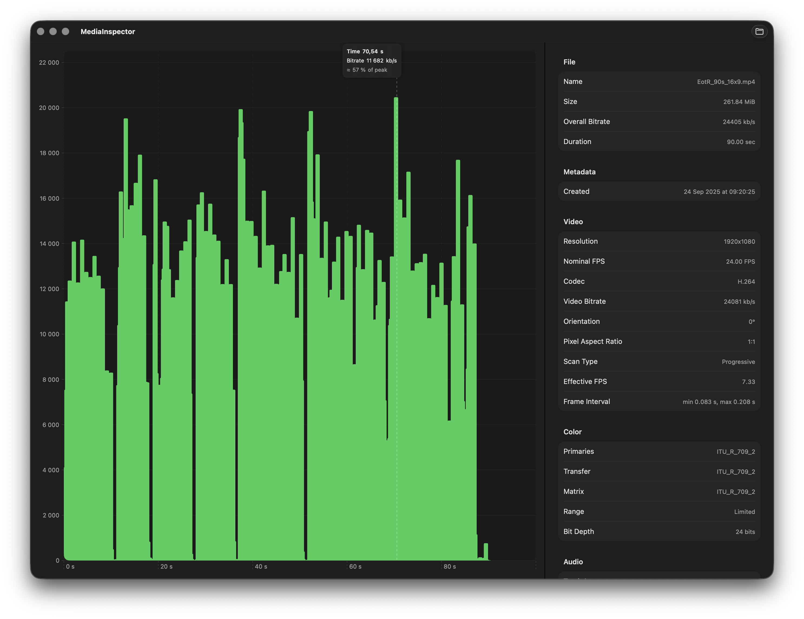

# MediaInspector

A professional macOS application for inspecting video and audio files with comprehensive metadata analysis, bitrate visualization, and keyframe detection.



## Overview

MediaInspector is a native macOS application built with SwiftUI that leverages AVFoundation and CoreMedia to provide detailed analysis of media files. It offers an intuitive interface for examining video and audio properties, visualizing bitrate patterns, and exploring keyframe structures.

## Features

### Video Analysis
- **Comprehensive Metadata**: Container format, codec information, resolution, frame rate, pixel aspect ratio, and display aspect ratio
- **Color & HDR Information**: Color space, chroma subsampling, bit depth, color primaries, transfer functions, and HDR format detection (Dolby Vision, HDR10, HLG, PQ)
- **Codec Support**: HEVC (H.265), AVC (H.264), AV1, VP9, and more with detailed configuration parsing
- **Resolution Categories**: Automatic classification (4K UHD, Full HD, etc.)

### Audio Analysis
- **Multi-Track Support**: Detailed information for all audio tracks
- **Track Properties**: Codec, channel layout, sample rate, bitrate, and language information
- **Codec Detection**: AAC, AC-3, E-AC-3, MP3, Opus, and more

### Bitrate Analysis
- **Interactive Charts**: Per-frame bitrate visualization with Swift Charts
- **Flexible Sampling**: Automatic, fixed interval, or per-frame sampling modes
- **Visualization Modes**: Aggregate bitrate by second, frame, or GOP (Group of Pictures)
- **Progressive Updates**: Real-time bitrate analysis with streaming updates
- **Performance Optimized**: Efficient frame extraction with configurable accuracy settings and LTTB downsampling

### Keyframe Detection
- **Visual Timeline**: Timeline visualization of keyframe positions
- **Thumbnail Strip**: Horizontal strip of keyframe thumbnails for quick navigation
- **Sync Sample Detection**: Identifies I-frames (intra-coded frames) without decoding

## System Requirements

- **macOS**: 15.2 (Sequoia) or later
- **Xcode**: 15.0 or later (for building from source)
- **Swift**: 5.0 or later

## Installation

### Building from Source

1. **Clone the repository**:
   ```bash
   git clone https://github.com/yourusername/MediaInspector.git
   cd MediaInspector
   ```

2. **Open the project**:
   ```bash
   open MediaInspector/MediaInspector.xcodeproj
   ```

3. **Build and run**:
   - Select your target Mac in Xcode
   - Press `Cmd+R` to build and run, or use Product → Run

### Dependencies

The project uses the following Apple frameworks (included with macOS):
- **AVFoundation**: Media file inspection and frame extraction
- **CoreMedia**: Low-level media format handling
- **SwiftUI**: User interface
- **AppKit**: macOS-specific features (file dialogs, images)
- **Charts**: Interactive chart visualization (macOS 15.0+)
- **Metal**: Graphics acceleration

No external dependencies or package managers required.

## Usage

### Opening Files

1. **File Dialog**: Click the "Open…" button in the toolbar or press `Cmd+O`
2. **Drag and Drop**: Drag a video or audio file onto the main window
3. **Supported Formats**: MP4, MOV, AVI, MPEG, and other common media formats

### Analysis Settings

Before analyzing a file, you can configure sampling options:

- **Automatic Mode**: Automatically determines optimal sampling based on video duration
- **Fixed Interval**: Sample at regular time intervals (configurable)
- **High Accuracy**: Enable for more precise bitrate measurements (may be slower)
- **Visualization Mode**: Choose how to aggregate bitrate data (per second, per frame, or per GOP)

### Interface

- **Main Chart**: Interactive bitrate visualization over time
- **Inspector Panel**: Toggle with `Cmd+Option+I` or the sidebar button
  - Quick summary card with key metrics
  - Collapsible sections for detailed metadata
  - Audio track information
  - Keyframe timeline and thumbnails
- **Resizable Inspector**: Drag the left edge of the inspector to adjust width

### Keyboard Shortcuts

- `Cmd+O`: Open file dialog
- `Cmd+Option+I`: Toggle inspector panel
- `Esc`: Cancel ongoing analysis

## Project Structure

```
MediaInspector/
├── MediaInspectorApp.swift          # App entry point
├── MediaInspector.swift              # Main window and UI
├── fileUtils.swift                   # File dialog utilities
│
├── Models/                           # Data models
│   ├── BitrateSample.swift           # Bitrate data model
│   └── MediaModels.swift             # ExtendedVideoInfo, AudioTrackInfo, etc.
│
├── ViewModels/                       # ViewModels and extensions
│   ├── MediaInspectorViewModel.swift      # ViewModel and state management
│   ├── MediaInspectorViewModel+Keyframes.swift
│   ├── MediaInspectorViewModel+Sampling.swift
│   └── MediaInspectorViewModel+Thumbnails.swift
│
├── Views/                            # UI components
│   ├── Chart/                        # Bitrate chart components
│   │   ├── BitrateChartView.swift
│   │   ├── BitrateChartComponents.swift
│   │   ├── BitrateChartDownsampling.swift
│   │   └── BitrateChartStatistics.swift
│   ├── Common/                       # Shared components
│   │   ├── AboutView.swift
│   │   ├── InspectorColumn.swift
│   │   ├── ResizeHandle.swift
│   │   └── SamplingSheet.swift
│   ├── Inspector/                    # Inspector panel
│   │   ├── InfoInspectorView/
│   │   │   ├── InfoInspectorView.swift
│   │   │   ├── QuickSummaryCard.swift
│   │   │   ├── CollapsibleSection.swift
│   │   │   └── ...
│   │   ├── InfoInspectorView+Copy.swift
│   │   └── InfoInspectorView+Header.swift
│   └── Keyframes/                    # Keyframe visualization
│       ├── KeyframeTimelineView.swift
│       ├── KeyframeTimelineDragHandling.swift
│       └── KeyframeThumbnailStrip.swift
│
└── Utils/                             # Core utilities
    ├── Analysis/                     # Frame and bitrate analysis
    │   ├── ExtractFramesStream.swift
    │   ├── FrameAggregation.swift
    │   └── FrameAnalysis.swift
    ├── Extraction/                    # Bitrate extraction
    │   ├── FastBitrateExtractor.swift
    │   ├── FastBitrateExtractor+Cursor.swift
    │   └── FastBitrateExtractor+Reader.swift
    ├── Formatting/                    # Formatting utilities
    │   ├── AspectRatioUtils.swift
    │   ├── ColorUtils.swift
    │   ├── FormatUtils.swift
    │   └── VideoUtils.swift
    ├── Media/                         # Media loading
    │   ├── AudioInfoLoader.swift
    │   ├── GenerateKeyframeThumbnails.swift
    │   └── VideoInfoLoader.swift
    └── Parsing/                       # Codec parsing
        ├── AV1Parser.swift
        └── KeyframeMarker.swift
```

## Architecture

MediaInspector follows a clean architecture pattern:

- **UI Layer**: SwiftUI views with `@MainActor` ViewModels
- **Business Logic**: Pure utility functions for parsing and analysis
- **Data Layer**: AVFoundation and CoreMedia for media access
- **Concurrency**: Swift Concurrency (`async`/`await`) for all async operations

The app uses progressive loading with `AsyncStream` to provide real-time updates during analysis, ensuring a responsive user experience even with large files.

## Contributing

Contributions are welcome! Please see [instructions.md](instructions.md) for detailed information about the codebase structure and contribution guidelines.

## License

See [LICENSE](LICENSE) file for details.

## Author

Built by Oscar Nord in Stockholm, Sweden

---

For detailed technical documentation and contribution guidelines, see [instructions.md](instructions.md).
